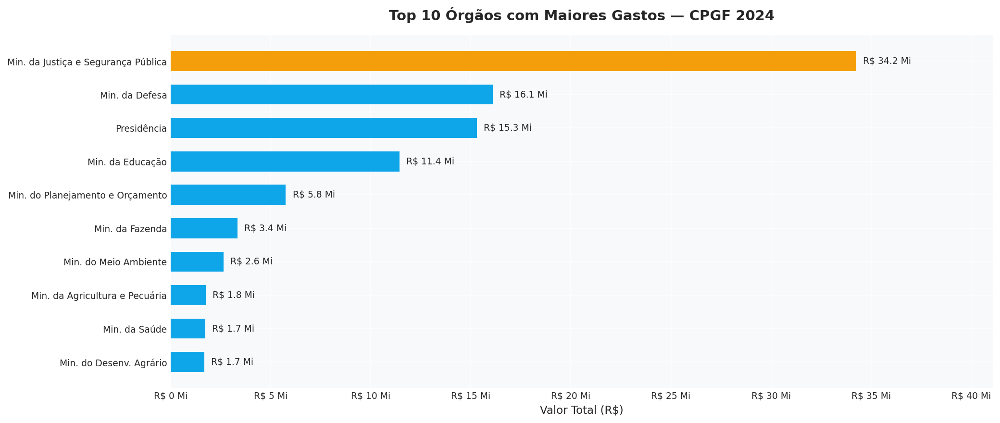
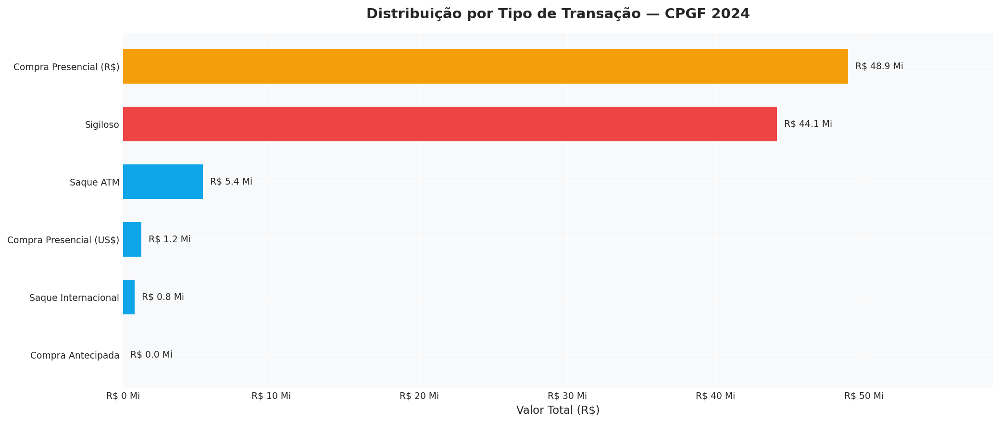
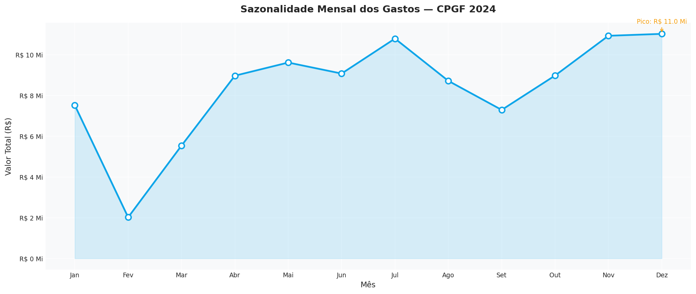
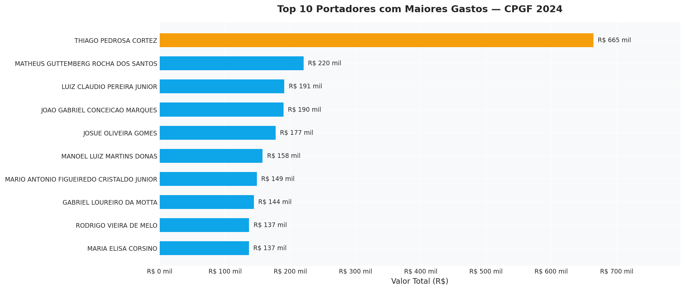
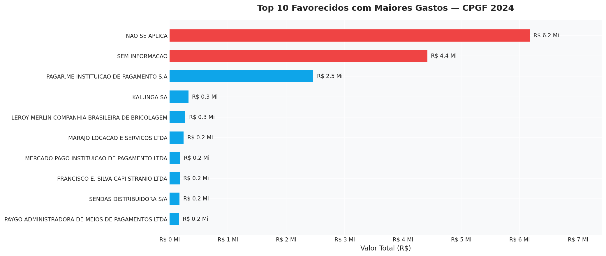
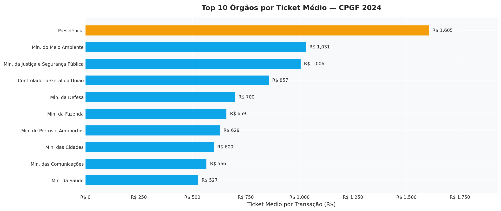

# Análise CPGF 2024 — Transparência nos Gastos com Cartões Corporativos do Governo Federal

Análise exploratória dos gastos com Cartões de Pagamento do Governo Federal (CPGF) em 2024, com 141.048 registros extraídos do Portal da Transparência. O projeto cobre o pipeline completo: coleta de dados, ETL com Python, consultas analíticas em SQL e visualizações no Jupyter Notebook.

**Tecnologias:** Python · Pandas · SQL · SQLite · DBeaver · Matplotlib · Seaborn · Jupyter

---

## Principais Descobertas

- **R$ 100,5 milhões** gastos em cartões corporativos por **30 órgãos** em 2024
- **43,9%** do valor total (R$ 44,1 Mi) é classificado como **sigiloso** — sem identificação pública do tipo de transação, valor praticamente igual aos R$ 48,9 Mi em compras presenciais identificadas
- A **Presidência da República** tem ticket médio de **R$ 1.605** por transação — **2,3x acima** da média geral de R$ 712
- **Dezembro** foi o mês de maior gasto (R$ 11 Mi) e **Fevereiro** o menor (R$ 2 Mi) — variação de 445%, padrão consistente com ciclos orçamentários
- **37,3%** dos registros possuem lacunas de identificação (favorecidos como 'NAO SE APLICA' ou portadores sem CPF)

---

## Pipeline de Dados

```
Portal da Transparência (12 CSVs mensais, encoding windows-1252)
        │
        ▼
importar_dados.py (ETL em Python)
  · Leitura dos 12 CSVs com tratamento de encoding
  · Renomeação e padronização de colunas
  · Conversão de valores (formato BR 1.234,56 → float 1234.56)
  · Carga incremental no SQLite
        │
        ▼
cpgf_2024.db (SQLite — 141.048 registros, 15 colunas)
        │
        ├──▶ consultas_cpgf.sql (10 consultas analíticas via DBeaver)
        │
        └──▶ cpgf_analise.ipynb (6 visualizações com insights documentados)
```

---

## Visualizações

### 1. Top 10 Órgãos por Gasto Total
Ministério da Justiça e Segurança Pública lidera com R$ 34,2 Mi — mais que o dobro do segundo colocado.



### 2. Distribuição por Tipo de Transação
R$ 44,1 Mi (43,9%) em transações sigilosas — valor praticamente igual aos R$ 48,9 Mi em compras presenciais identificadas.



### 3. Sazonalidade Mensal
Padrão de aceleração no segundo semestre com pico em Dezembro (R$ 11 Mi) e vale em Fevereiro (R$ 2 Mi).



### 4. Top 10 Portadores
Servidores com maior volume de gastos individuais (registros sigilosos excluídos).



### 5. Top 10 Favorecidos
Empresas que mais receberam via CPGF (excluídos: sigilosos, 'NAO SE APLICA' e 'SEM INFORMACAO').



### 6. Ticket Médio por Órgão
Presidência com R$ 1.605/transação — 2,3x acima da média geral. Filtro: apenas órgãos com 50+ transações.



---

## Estrutura do Projeto

```
├── cpgf_analise.ipynb             # Análise exploratória com 6 visualizações
├── importar_dados.py              # ETL: 12 CSVs → SQLite
├── consultas_cpgf.sql             # 10 consultas SQL (DBeaver)
├── grafico_1_orgaos.png           # Top 10 órgãos por gasto
├── grafico_2_transacao.png        # Distribuição por tipo de transação
├── grafico_3_sazonalidade.png     # Sazonalidade mensal
├── grafico_4_portadores.png       # Top 10 portadores
├── grafico_5_favorecidos.png      # Top 10 favorecidos
├── grafico_6_ticket_medio.png     # Ticket médio por órgão
├── .gitignore                     # Exclui .venv/ e arquivos temporários
└── README.md
```

> O banco `cpgf_2024.db` (141 MB) não está no repositório por tamanho. Para recriá-lo, baixe os 12 CSVs do Portal da Transparência e execute `python importar_dados.py`.

---

## Instalação

### 1. Clone o repositório
```bash
git clone https://github.com/Lucasfontez/CPGF-2024-Analise.git
cd CPGF-2024-Analise
```

### 2. Crie e ative um ambiente virtual
```bash
python -m venv .venv

# Windows
.venv\Scripts\activate

# Linux/Mac
source .venv/bin/activate
```

### 3. Instale as dependências
```bash
pip install pandas matplotlib seaborn jupyter
```

### 4. Execute o notebook
```bash
jupyter notebook cpgf_analise.ipynb
```

---

## Tecnologias

| Tecnologia | Uso |
|---|---|
| Python 3.13 | Linguagem principal |
| Pandas | Manipulação e análise de dados |
| SQL | Consultas analíticas sobre o banco |
| SQLite | Armazenamento estruturado |
| DBeaver | Interface para execução das consultas SQL |
| Matplotlib | Visualizações estáticas |
| Seaborn | Paleta de cores e estilo |
| Jupyter Notebook | Análise exploratória e documentação |

---

## Fases do Projeto

1. **Coleta** — Download dos 12 CSVs mensais do Portal da Transparência
2. **ETL** — Limpeza, padronização e carga no SQLite (`importar_dados.py`)
3. **Análise SQL** — 10 consultas analíticas no DBeaver (`consultas_cpgf.sql`)
4. **Análise exploratória** — 6 visualizações com insights no Jupyter (`cpgf_analise.ipynb`)

---

## Autor

**Lucas Fontes**

- GitHub: [github.com/Lucasfontez](https://github.com/Lucasfontez)
- LinkedIn: [linkedin.com/in/lucassfontesc](https://www.linkedin.com/in/lucassfontesc/)
- Email: fonteslucas678@gmail.com

---

## Licença

Este projeto está sob licença MIT.

---

**Fonte dos dados:** [Portal da Transparência — Governo Federal](https://portaldatransparencia.gov.br/)